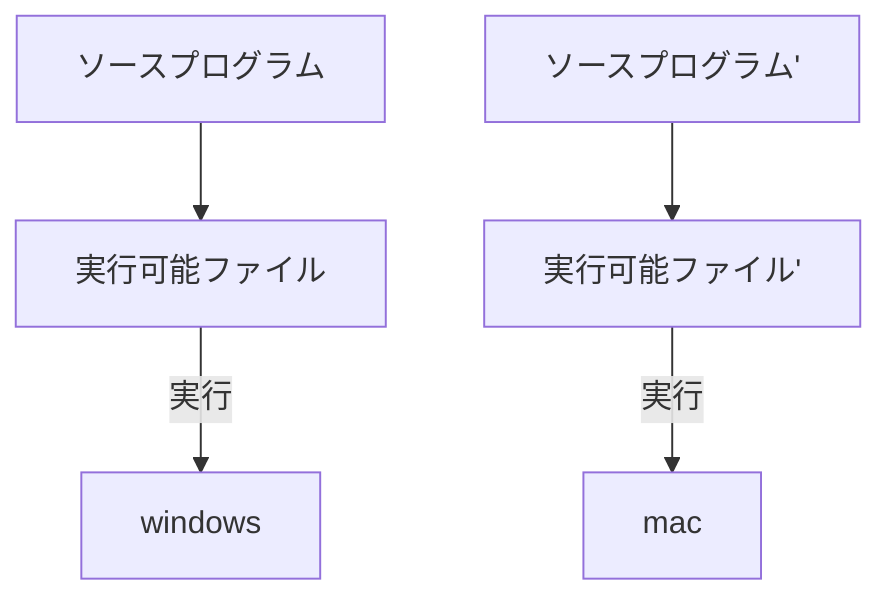
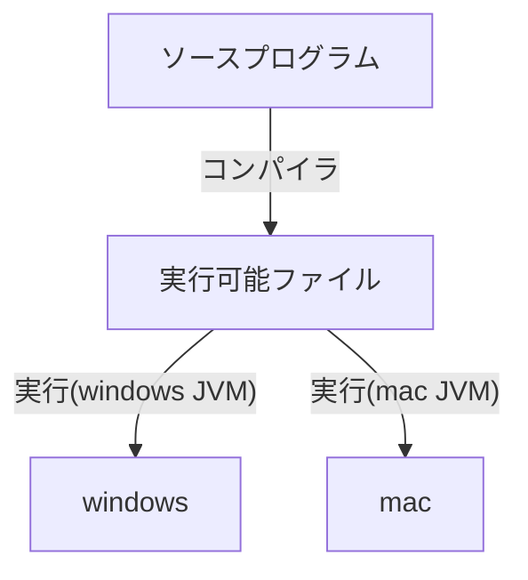

2025/6/5
[[#Java]]

---
- オブジェクト指向 - 大規模開発に使用
- プラットフォーム非依存 - どこでも動くプログラム
	**プラットフォーム依存言語(C言語など)**

　　　**プラットフォーム非依存言語**(Javaなど)

- JVM(Java Virtual Machine) 
　プログラムを動かすためのソフトウェア
　Java仮想マシンとも呼ぶ

+ JDK(Java Development Kit)
	開発者用の環境
	Javaの開発環境
	Oracle社のサイトからダウンロード可能
	コンパイラや便利なツールがまとめられる
	

